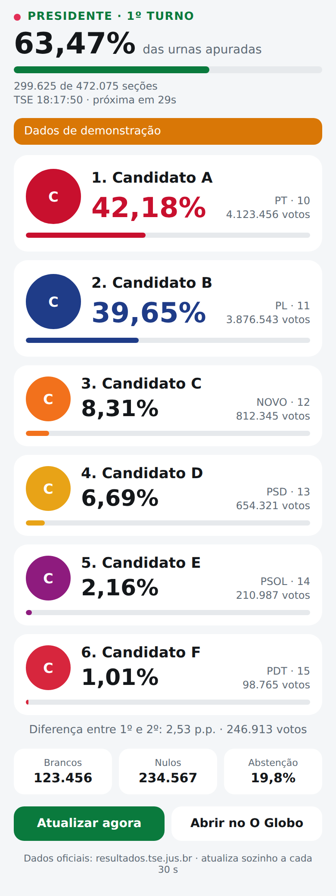

# Apuração 2026 — widget de iPhone

Acompanhe a apuração **ao vivo** das Eleições 2026 no iPhone, com dados lidos direto dos arquivos
públicos de resultado do **TSE** (a mesma fonte oficial usada pelos infográficos da imprensa):

- **Widget** (tela inicial e tela bloqueada) com os principais presidenciáveis: foto oficial, nome,
  partido e percentual em destaque, % de urnas apuradas e diferença entre 1º e 2º colocados.
- **Painel ao vivo** que abre ao tocar no widget: todos os candidatos com foto, votos e %, brancos,
  nulos e abstenção, e **atualização automática a cada 30 segundos** direto do TSE. Tem um botão para
  abrir a [apuração do O Globo](https://infograficos.oglobo.globo.com/politica/eleicoes-2026/apuracao-resultado-ao-vivo-2026.html#/presidente?tipo=apuracao&turno=1).

Ele roda no app gratuito **[Scriptable](https://apps.apple.com/app/scriptable/id1405459188)**, que
permite criar widgets próprios sem precisar de Xcode nem de conta de desenvolvedor da Apple.

## Instalação (2 minutos)

1. Instale o **Scriptable** pela App Store e abra-o uma vez.
2. No Scriptable, toque em **+**, cole o conteúdo de [`scriptable/Instalar.js`](scriptable/Instalar.js)
   e toque em ▶︎. Ele baixa o script **Apuração 2026** (rode de novo quando quiser atualizar).
   - Alternativa: crie um script novo chamado `Apuração 2026` e cole direto o conteúdo de
     [`scriptable/Apuracao2026.js`](scriptable/Apuracao2026.js).
3. Na tela inicial, segure num espaço vazio › **Editar** › **Adicionar widget** › **Scriptable**,
   escolha o tamanho (pequeno, médio ou grande) e adicione.
4. Segure o widget › **Editar widget** › em **Script** escolha `Apuração 2026`.
   O toque no widget já abre o painel ao vivo (não precisa configurar nada).
5. *(Opcional)* Para ter um **ícone de app** na tela inicial: no Scriptable, segure o script
   `Apuração 2026` › **Details** › **Add to Home Screen**. Ele abre direto no painel ao vivo.

Para a **tela bloqueada**, adicione um widget do Scriptable lá também (formatos em linha,
retangular ou circular) e escolha o mesmo script.

## Escolhendo o que acompanhar

No campo **Parameter** do widget (opcional):

| Parâmetro        | Mostra                                   |
| ---------------- | ---------------------------------------- |
| *(vazio)*        | Presidente, Brasil                       |
| `presidente mg`  | Presidente, só votos de MG               |
| `governador sp`  | Governador de SP                         |
| `senador rj`     | Senador do RJ                            |
| `t1` / `t2`      | Força o 1º ou o 2º turno                 |
| `demo`           | Dados fictícios, para testar o visual    |

Dá para ter vários widgets ao mesmo tempo, cada um com um parâmetro (ex.: um de presidente e outro
de governador). Sem `t1`/`t2`, o widget passa sozinho para o 2º turno quando o TSE publicar os
dados dele.

O widget médio mostra os 3 primeiros; o grande, os 5 primeiros com votos e a diferença entre 1º e 2º;
o pequeno, os 2 primeiros.

## Como funciona

- Os códigos das eleições vêm do índice oficial do TSE (`comum/config/ele-c.json`); se ele não
  responder, usa os de 2026: federal **6257** (1º turno) / **6258** (2º) e estadual **6259** / **6260**.
- O resultado vem de
  `https://resultados.tse.jus.br/oficial/ele2026/<eleição>/dados/<uf>/<uf>-c<cargo>-e<eleição>-u.json`.
- O último resultado fica salvo no aparelho: sem internet, o widget mostra o dado anterior com o aviso
  "Offline".
- As fotos oficiais dos candidatos vêm do TSE e ficam guardadas no aparelho; sem foto, aparece um
  círculo com as iniciais na cor do partido.
- **Quem decide quando o widget atualiza é o iOS**, com uma cota de recargas por dia (na prática,
  de 15 em 15 min ou mais, e menos ainda com o Modo de Pouca Energia ligado). O rodapé mostra
  `TSE hh:mm` (hora do dado) e `widget ↻ hh:mm` (última vez que o iOS rodou o widget). Para
  acompanhar em tempo real, toque no widget: o painel ao vivo se atualiza a cada 30 s.
- Para o iOS atualizar com mais frequência: deixe o **Modo de Pouca Energia desligado** e a
  **Atualização em 2º Plano** ligada para o Scriptable (Ajustes › Geral › Atualização em 2º Plano).

Projeto independente, sem vínculo com o TSE nem com o O Globo.
